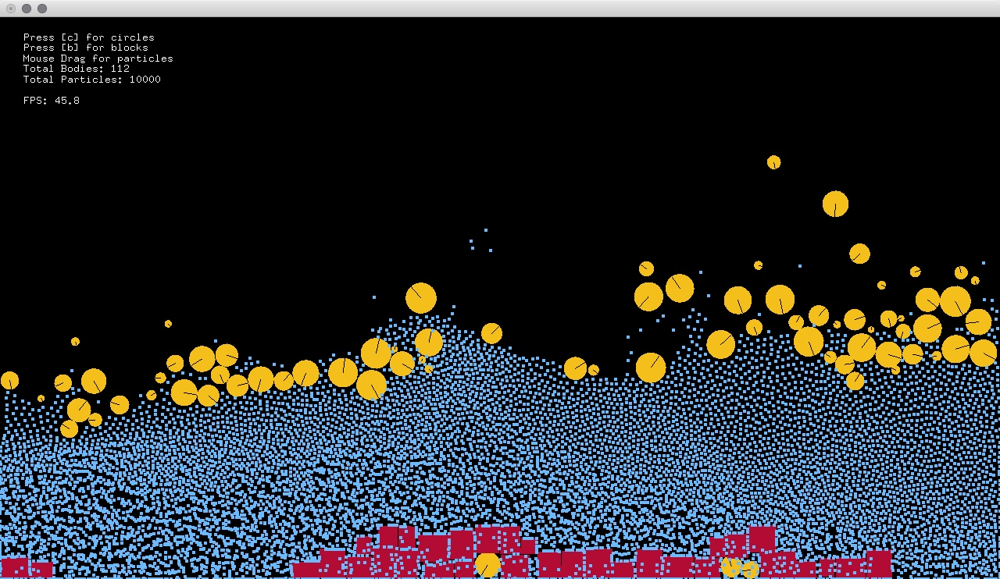

ofxLiquidFun
===============

openFrameworks wrapper for [LiquidFun](http://google.github.io/liquidfun/) by Google.

[LiquidFun](http://google.github.io/liquidfun/) is a 2D rigid-body and fluid simulation C++ library for games based upon Box2D. This addon is also based on [ofxBox2D](https://github.com/vanderlin/ofxBox2d) which is Todd Vanderlin's Box2D wrapper for openFrameworks.

https://vimeo.com/104151359

## Installation

First, pick the branch that matches your version of openFrameworks: 

- openFrameworks 0.9.8 : [0.9.8](https://github.com/tado/ofxLiquidFun/tree/0.9.8) branch
- openFrameworks 0.10.0 : [master](https://github.com/tado/ofxLiquidFun/tree/master) branch

## Todo

- Add PerticleGroup class (ofxBox2dParticleGroup?)
- Separate LiquidFun class from ofxBox2d.
- ...etc.

## License

The MIT License (MIT)
